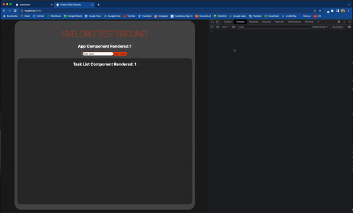
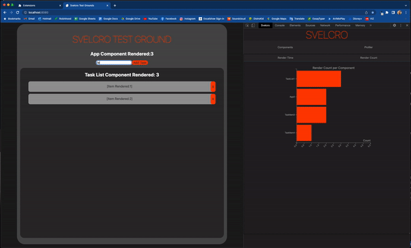
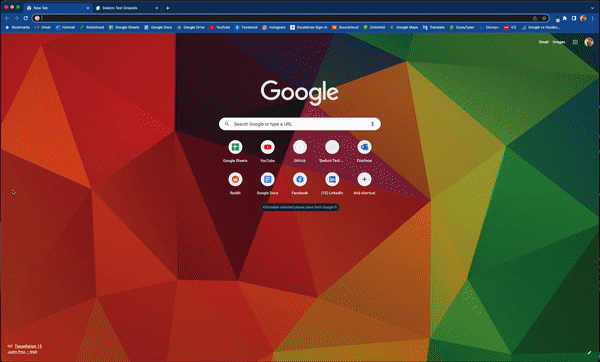

<p align="center">
  
  <h1 align="center"></h1>
</p>

[](https://github.com/oslabs-beta/Svelcro/pulls)
[]()

<!-- []() -->

The first component performance tracker for Svelte applications.

# Features

- Component Dependency Tree - View your components as a dependency tree or hierarchy.
  
- Component Stats - List state and properties in your components.
- Profiler
  - Render Performance - Monitors component render time from start to finish.
    
  - Render Count - Tracks how many times your components have rendered.
    

# Installation

Extension Coming To Chrome Store Soon...

Feel free to fork and clone this repo! Otherwise, just download Svelcro and save it somewhere on your computer.

Make Svelcro/dev-app your current directory,install depencencies, and run build.

```
cd Svelcro/dev-app
npm install
npm run build
```



Navigate to Chrome's extensions page at `chrome://extensions/`.

Turn on 'developer mode' in the top-right corner of the page.

Click on 'load unpacked' at the top-left, and select your local copy of the Svelcro directory.

Open up your Chrome DevTools, and check to make sure Svelcro is available in the dropdown menu of the navbar!

# How To Use

Make sure your svelte application is in development mode.

You can then open up Chrome DevTools and navigate to Svelcro.

Visualize component dependencies and their respective state in the "Components" tab or monitor your component render performance in the "Profiler" tab.

# Troubleshooting

- Have you installed your Svelcro dependencies?
- Sometimes it helps to refresh your webpage or Svelcro in the Chrome extensions page.

# What's to come

- Monitor applications built with SvelteKit
- Time Machine feature to track history of application state

# Contribute

We would love to hear from you!

Svelcro is currently in beta. If you would like to contribute please contact the authors at svelcrodt@gmail.com.

Notice any issues or bugs? Open an issue!

# Learn More

<!-- PLACEHOLDER FOR LANDING PAGE, ADD LANDINGPAGE LINK-->

Visit the [Svelcro website!]()

<!-- PLACEHOLDER ARTICLE, ADD ARTICLE LINK -->

Read more at Medium - [Component Performance Monitoring with Selvro]()

# Contributors

Sara Kivikas - [@skivikas](https://github.com/skivikas)

Rankin Draa - [@rankind94](https://github.com/rankind94)

Yanming Yu - [@jimmyjameswong](https://github.com/jimmyjameswong)

Zachary Daniels - [@zackdaniels](https://github.com/zackdaniels)

# License

[MIT](./docs/LICENSE.md)
